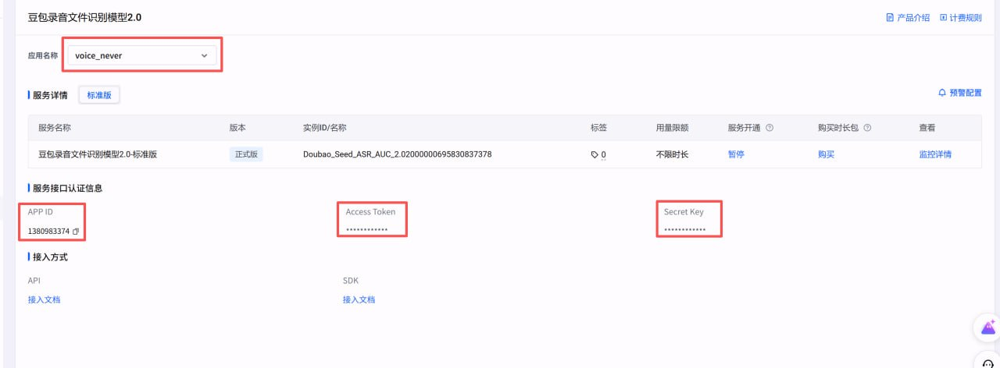
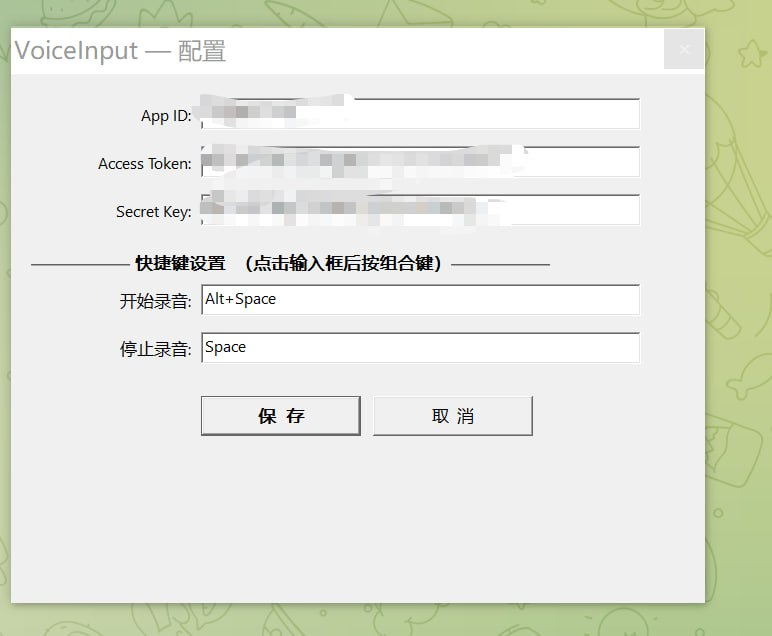

# VoiceInput — 语音输入工具

按下快捷键录音，自动识别语音并粘贴文字到当前光标位置。支持 Windows 和 macOS 双平台。

---

## 🚀 快速开始

### 1. 获取火山引擎 API 密钥

访问 [火山引擎控制台](https://console.volcengine.com/speech/service/10039?AppID=6156196362) 获取以下信息：



需要获取：App ID、Access Token、Secret Key

### 2. 在软件中配置

**先运行程序**，然后**右键点击系统托盘图标** → **设置…**，填入火山引擎获取的信息（无需手动修改配置文件）：



需要填写：App ID、Access Token、Secret Key，可自定义快捷键。

### 3. 运行程序

**Windows:**
```batch
cd Windows
voice_input.exe
```

**macOS:**
```bash
cd Mac
# 首次运行需要激活（清除 Gatekeeper 标记）
bash activate.sh
# 然后启动
open VoiceInput.app
```

首次启动需要授权：
- 系统设置 → 隐私与安全 → **辅助功能** → 允许 VoiceInput
- 系统设置 → 隐私与安全 → **麦克风** → 允许 VoiceInput

---

## ⌨️ 使用方法

| 操作 | 快捷键 |
|------|--------|
| 开始录音 | Alt+Space（可自定义） |
| 停止录音并识别 | Space（可自定义） |
| 取消录音 | ESC |

**使用流程：**
1. 按 `Alt+Space` 开始录音（屏幕边缘出现红色光晕，底部显示音波条）
2. 说话...
3. 按 `Space` 停止录音，自动识别并粘贴文字
4. 或按 `ESC` 取消录音

**视觉反馈：**
- 录音时屏幕边缘出现动态红色光晕
- 屏幕底部中央显示动态音波条，提示当前状态
- 系统托盘图标根据状态变色（灰=待机，红=录音，蓝=识别）

**托盘图标菜单（右键点击）：**
- ✅ 自动发送 — 识别完成后自动按 Enter 发送
- 设置… — 打开配置对话框
- 退出 VoiceInput

---

## ✨ 功能特性

- 🎙️ **语音录音** — 快捷键触发，实时采集音频
- 🤖 **语音识别** — 火山引擎 Seed ASR，支持中英文混合
- 📋 **自动粘贴** — 识别结果自动写入剪贴板并粘贴
- ↩️ **自动发送** — 可选自动按 Enter 发送
- ❌ **ESC 取消** — 录音中随时取消
- ⚙️ **自定义快捷键** — 支持各种组合键

---

## 📁 文件结构

```
VoiceInput/
├── Windows/
│   ├── voice_input.exe      # Windows 可执行文件
│   ├── config.json          # 配置文件
│   └── build.bat            # 编译脚本
│
└── Mac/
    ├── VoiceInput.app/      # macOS 应用
    └── config.json          # 配置文件
```

---

## 🛠️ 编译（可选）

**Windows:**
```batch
cd Windows
build.bat
```

**macOS:**
```bash
cd Mac
swift build -c release
```

---

## 📄 许可证

MIT License
